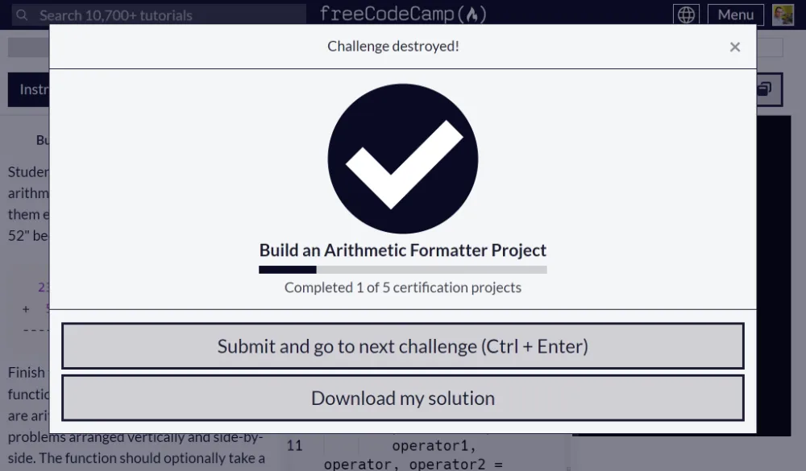

# Resolución Proyecto Build an Arithmetic Formatter Project

Código solución del [primer proyecto requisito obligatorio](https://www.freecodecamp.org/learn/scientific-computing-with-python/build-an-arithmetic-formatter-project/build-an-arithmetic-formatter-project) para obtener la [Freecodecamp Scientific Computing with Python Certification](https://www.freecodecamp.org/learn/scientific-computing-with-python).

## Tabla de Contenidos

- [Resolución Proyecto Build an Arithmetic Formatter Project](#resolución-proyecto-build-an-arithmetic-formatter-project)
  - [Tabla de Contenidos](#tabla-de-contenidos)
  - [Approved project](#approved-project)
  - [Instructions](#instructions)
  - [Código Solución](#código-solución)
  - [All tests passed](#all-tests-passed)

## Approved project



## Instructions


## Código Solución

```py
def arithmetic_arranger(problems, show_answers=False):
    if len(problems) > 5:
        return 'Error: Too many problems.'
    errors=[]

    error1='Error: Operator must be \'+\' or \'-\'.'
    error2='Error: Numbers must only contain digits.'
    error3='Error: Numbers cannot be more than four digits.'

    for problem in problems:
        operator1, operator, operator2 = problem.split()
        if operator not in ['+', '-'] and error1 not in errors:
             errors.append(error1)
        if not (operator1.isdigit() and operator2.isdigit()) and error2 not in errors:
            errors.append(error2)
        if len(operator1) > 4 or len(operator2) > 4 and error3 not in errors:
            errors.append(error3)
    for error in errors:
        return error

    cadenas_sin_resultados={'first_row':'','second_row':'','third_row':'','fourth_row':''}

    for problem,i in zip(problems,range(len(problems))):
        operator1, operator, operator2 = problem.split()
        largo_maximo=max(len(operator1),len(operator2))+2

        first_row=operator1.rjust(largo_maximo)
        second_row=operator+' '+operator2.rjust(largo_maximo-2)
        third_row='-'*largo_maximo

        if operator=='+':
            fourth_row=str(int(operator1)+int(operator2)).rjust(largo_maximo)
        else:
            fourth_row=str(int(operator1)-int(operator2)).rjust(largo_maximo)
        problem_separator=' '*4

        if i>0:
            cadenas_sin_resultados['first_row']+=problem_separator
            cadenas_sin_resultados['second_row']+=problem_separator
            cadenas_sin_resultados['third_row']+=problem_separator
            cadenas_sin_resultados['fourth_row']+=problem_separator

        cadenas_sin_resultados['first_row']+=first_row
        cadenas_sin_resultados['second_row']+=second_row
        cadenas_sin_resultados['third_row']+=third_row
        cadenas_sin_resultados['fourth_row']+=fourth_row

    cadena_sin_resultados=cadenas_sin_resultados['first_row']+'\n'+cadenas_sin_resultados['second_row']+'\n'+cadenas_sin_resultados['third_row']

    if show_answers is False:
        return cadena_sin_resultados
    else:
        return cadena_sin_resultados+'\n'+cadenas_sin_resultados['fourth_row']

print(f'\n{arithmetic_arranger(["3801 - 2", "123 + 49"], True)}\n')
```

## All tests passed


